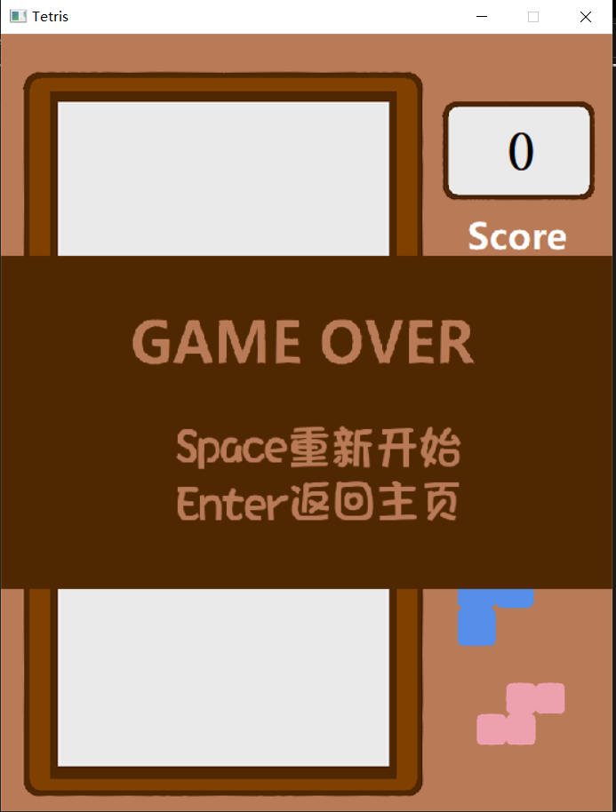

# 俄罗斯方块Tetris游戏文档  
## 1、项目配置
运行Assembly_Game.sln文件，在右侧Assembly_Game项目上右键-属性，进入属性页，需要设置如下内容：

1、配置属性-高级，MSVC工具集选择14.26版本

2、链接器-常规-附加库目录，选择自己的\masm32\lib和本项目目录下的\src\lib

3、Microsoft Macro Assembler-General-Include Paths，选择自己的\masm32\inc和本项目目录下的\src\inc

**注意：Release和Debug两个模式下不共享配置，因此需要对两个模式分别进行上述设置**

## 2、项目结构
```
.
├─.vs
│  └─Assembly_Game
│      └─v16
├─Assembly_Game：项目文件
│  ├─Debug
│  │  └─Assembly_Game.tlog
│  ├─Release
│  │  └─Assembly_Game.tlog
│  └─x64
│      └─Debug
│          └─Assembly_Game.tlog
├─Debug：Debug模式下的exe
├─Release：Release模式下的exe
└─src：资源文件，目录下的asm文件为源代码
    ├─img：图片文件，目录下的图片直接被调用
    │  ├─no_bg：去除背景的图片
    │  └─resources：其他开源图片资源
    ├─inc：包含文件，作为asm文件的头文件
    ├─lib：附加库
    ├─misc：杂项，项目中没有用上的部分
    │  ├─acllib：acllib的文档和c版本
    │  │  ├─doc
    │  │  └─src
    │  ├─pics：md文件需要用的图
    │  └─proto：实现的C版本原型
    └─se：音效
```
## 3、头文件与源文件
本来想使用MVC设计模式，但时间有限搞得项目结构有点四不像，先凑合看吧😢

### .inc头文件
|文件名称|说明|
|-------|----|
|acllib.inc|对acllib开源的.h和.c文件封装成了.lib文件，.inc文件中为可调用的函数|
|msvcrt.inc|运行时库对应的头文件，\masm32\inc下应该有，不加应该也可以|
|control.inc|监听鼠标、键盘事件和定时器，以及调用的函数（这部分应该放到model里）|
|model.inc|不但有MVC中的model还有view，处理信息与绘制图片、播放音乐等|
|public_var.inc|公有数据，有单个方块信息、游戏内已存在方块信息等|

### .asm源文件
|文件名称|说明|
|-------|----|
|main.asm|与WinMain的功能一致，其中init_first和init_second分别为得到句柄信息、注册窗口和消息循环监听，封装在acllib.lib中。中间部分等效于acllib中的Setup函数|
|control.asm|同头文件，具体函数的作用在代码中有注释|
|model.asm|同头文件|
|public_var.asm|同头文件|

## 4、游戏运行
双击exe文件运行，显示主界面信息:


点击开始游戏后进入游戏界面：


按下空格键暂停，进入暂停界面，再按空格可以恢复：


当方块到顶部后进入游戏结束界面：


## 5、其他
本项目参考了许多其他开源项目，在这里进行说明和致谢：

绘图使用的图形库：[ACLLib](https://github.com/wengkai/ACLLib)

整体项目结构与部分素材：[simple_game](https://github.com/taskmgr/simple_game)

部分素材来源：[TetrisBattle-Assembly](https://github.com/Manchery/TetrisBattle-Assembly)

此外，项目的核心功能先是采用C语言进行实现，之后再将其改成masm格式。

部分核心功能的C实现：[simple_tetris](src/misc/proto/simple_tetris.cpp)
